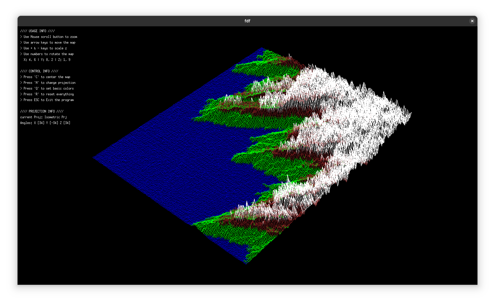
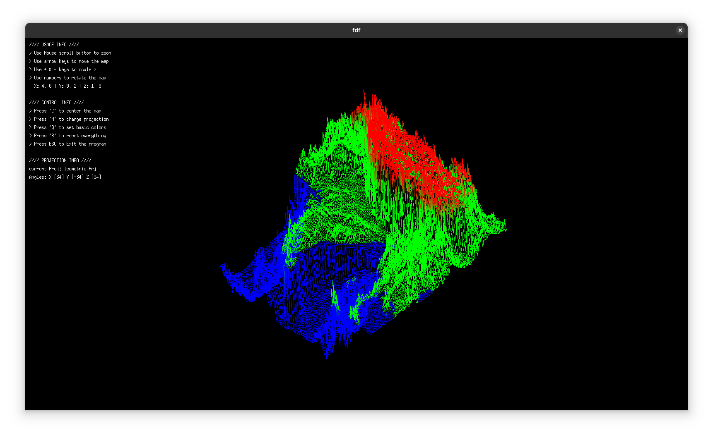
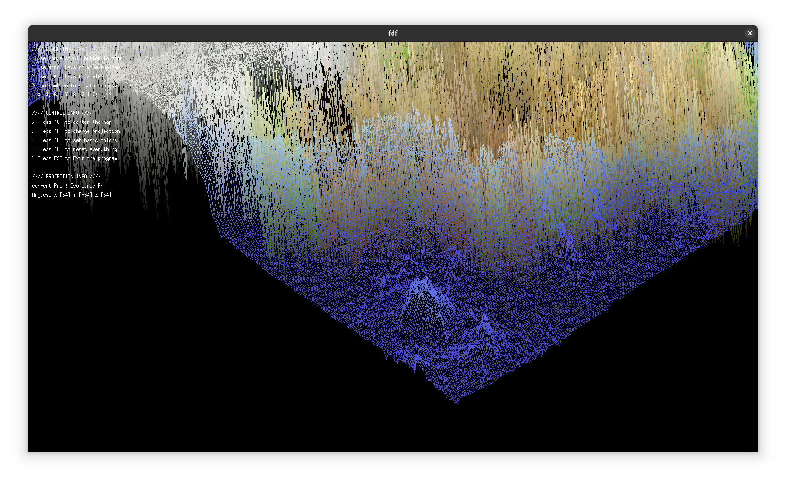

# 🌄 FdF - 3D Wireframe Renderer

## 📖 Description

The representation in 3D of a landscape is a critical aspect of modern mapping.  
For example, in these times of space exploration, having a 3D representation of Mars is a prerequisite for its conquest.  
As another example, comparing various 3D representations of an area of high tectonic activity allows better understanding of these phenomena and their evolution, improving preparedness.  
Today, it is your turn to model magnificent 3D landscapes, whether imaginary or real.

This project renders 3D wireframe models from `.fdf` map files using a minimal graphics library.

## 🧰 Requirements

- Linux
- gcc
- make
- X11 libraries
- zlib (liblz)

## 🛠️ Installation

### 📦 Clone the project
```bash
git clone git@github.com:laoubaid/fdf.git
cd fdf
```
### 🖼️ Clone MiniLibX (graphics library)
Visit [MiniLibX on GitHub](https://github.com/42paris/minilibx-linux) and clone it:
```bash
cd minilibx-linux
make
```
### 🧱 Build the project
```bash
cd ..
make
```
### 🚀 Usage
```bash
./fdf maps/42.fdf
```




